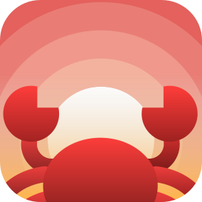

<div align="center">

<h1>RustLings-Web</h1>
</div>

RustLings-Web es una plataforma educativa interactiva diseñada para aprender Rust directamente desde tu navegador. Sin descargas, sin configuraciones complejas - ¡solo tú y Rust!

## 🚀 Características

* [x] Aprende Rust sin instalar nada en tu computadora
* [x] Ejercicios interactivos que puedes resolver directamente en el navegador
* [x] Interface intuitiva y amigable para principiantes
* [ ] Retroalimentación inmediata sobre tus soluciones
* [ ] Progreso guardado automáticamente
* [ ] Soporte para múltiples idiomas

## 🌐 Cómo Empezar

1. Visita RustLings-Web
2. Haz click en `Aprender`
3. ¡Comienza a programar! 🦀

## 🤝 Contribuir

¡Las contribuciones son bienvenidas! Si deseas ayudar a mejorar RustLings-Web, puedes:

1. Fork el repositorio
2. Crear una nueva rama

```bash
git checkout -b feature/mejora
```

3. Commit tus cambios

```bash
git commit -am 'Añade alguna mejora'
```

4. Push a la rama

```bash
git push origin feature/mejora
```

5. Crear un Pull Request

## ✨ Creadores principales

<div align="center">
<a href="https://github.com/SergioRibera" target="_blank">
  
</a>
<a href="https://github.com/Wilovy09" target="_blank">
  
</a>
<a href="https://github.com/JonathanACO" target="_blank">
  
</a>
</div>
