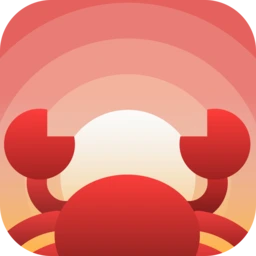

<h1>RustLings-Web</h1>

RustLings-Web es una plataforma educativa interactiva diseñada para aprender Rust directamente desde tu navegador. Sin descargas, sin configuraciones complejas - ¡solo tú y Rust!

## 🚀 Características

* [x] **Aprende Rust sin instalar nada** - Editor de código integrado con soporte completo para Rust
* [x] **Ejercicios interactivos** - Resuelve ejercicios directamente en el navegador con feedback inmediato
* [x] **Playground integrado** - Ejecuta código Rust en tiempo real
* [x] **Sistema de progreso** - Rastrea tu avance a través de las lecciones
* [x] **Autenticación** - Guarda tu progreso con tu cuenta de GitHub
* [x] **Certificados** - Obtén certificados al completar cursos
* [x] **Soporte multiidioma** - Disponible en español e inglés
* [x] **Interface moderna** - Construida con Astro y diseño responsivo
* [x] **Base de datos integrada** - Progreso persistente con D1 de Cloudflare

## 🌐 Cómo Empezar

1. Visita [RustLings-Web](https://rustlings-web.pages.dev)
2. Haz click en **"Aprender"**
3. Inicia sesión con tu cuenta de GitHub
4. ¡Comienza a programar! 🦀

## 🤝 Contribuir

¡Las contribuciones son bienvenidas! Puedes contribuir de varias formas: [CONTIBUTING.md](./CONTRIBUTING.md)

### Reportar Issues

- Incluye información detallada sobre el problema
- Añade pasos para reproducir el issue

## ✨ Contribuciones

  

---

  
Hecho con ❤️ por la comunidad de <strong>Rust en Español</strong>

